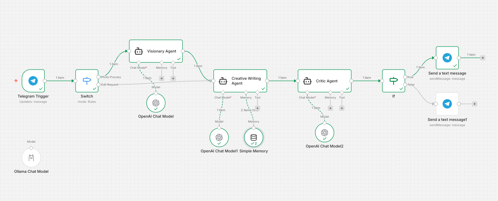

# 🤖 AI Social Architect: Multi-Agent Workflow

[](https://n8n.io/)
[](https://openai.com/)
[](https://telegram.org/)

An advanced **Multi-Agent Orchestration** system built in n8n that transforms visual assets into brand-aligned social media content. This project demonstrates a production-grade AI pipeline featuring **LLM-as-a-Judge** scoring and a stateful **Human-in-the-Loop** feedback loop.

---

## 🏗️ Architecture & Multi-Agent Roles

Instead of a single prompt, this workflow distributes intelligence across specialized agents to ensure professional-grade output:

1.  **The Visionary Agent (Perception)**: Analyzes the uploaded image to extract technical metadata (lighting, composition, mood) and aesthetic context.
2.  **The Creative Voice (Generation)**: Processes the vision data to draft minimalist captions. It is connected to **Session Memory** to allow for iterative edits.
3.  **The Critic Agent (LLM-as-a-Judge)**: Acts as an automated quality gate. It evaluates the caption against a strict **Brand Rubric** and assigns a score.


---

## 🧠 Key Technical Features

### 1. LLM-as-a-Judge (Rubric Scoring)
The workflow implements an automated evaluation step. The **Critic Agent** uses a set of rubrics to grade the content:
* **Minimalism**: Is the text concise? (0-10)
* **Aesthetic**: Does it follow the "lowercase-only" brand rule? (0-10)
* **Quality Gate**: An `If Node` acts as a filter; only posts scoring **7/10 or higher** are forwarded for approval.

### 2. Human-in-the-Loop (HITL) & Stateful Memory
Unlike linear automations, this workflow supports a **Feedback Loop**:
* **Session ID Tracking**: Uses `{{ $json.message.chat.id }}` to maintain conversation history.
* **Edit Requests**: Users can reply to the bot (e.g., *"Add 4 hashtags"* or *"Make it punchier"*).
* **Smart Routing**: A `Switch Node` detects if the input is a **New Photo** (starts a new process) or **Text Feedback** (updates the current draft via memory).

---

## 🚦 Workflow Logic

1.  **Ingress**: Telegram Trigger receives photo/text.
2.  **Logic Branch**: 
    * **Photo?** → Visionary → Creative → Critic → User.
    * **Text?** → Creative (w/ Memory) → User.
3.  **Memory Port**: `Window Buffer Memory` stores the last 5-10 interactions to maintain context for edits.

---

## 🛠️ Setup Instructions

1.  **Import**: Import the provided `n8n_multi_agent_social_bot.json` into n8n.
2.  **Credentials**: 
    * Set up a **Telegram Bot** via `@BotFather`.
    * Connect your **LLM Provider** (OpenAI, Anthropic, etc.).
3.  **Session Key**: Verify the Memory node is using the dynamic expression:
    ```javascript
    {{ $node["Telegram Trigger"].json.message.chat.id }}
    ```
4.  **Activate**: Turn the workflow on and send a photo to your bot to begin.

---

## 📸 Preview


